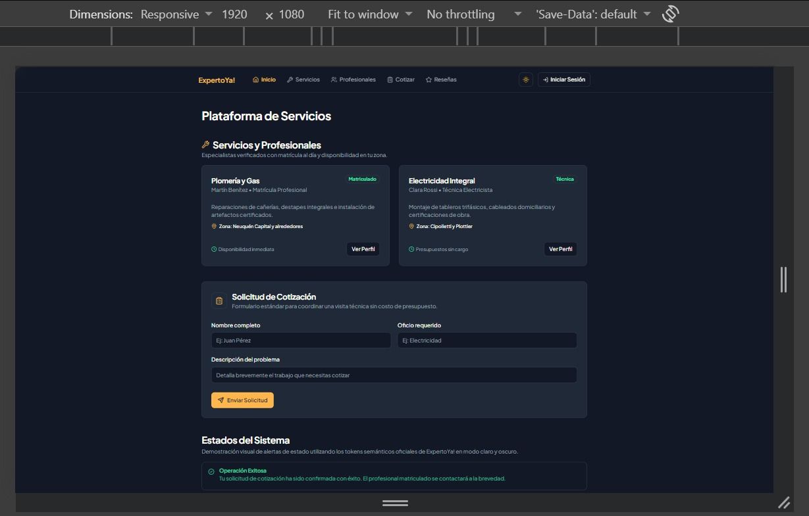
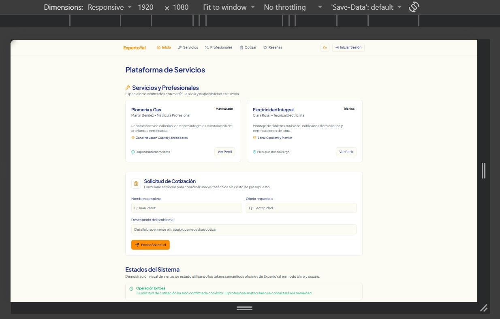
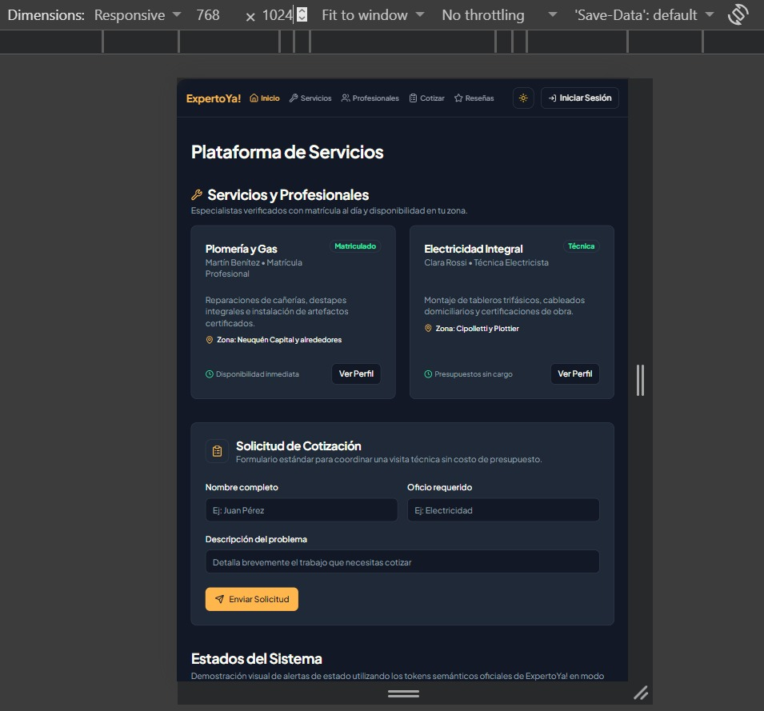
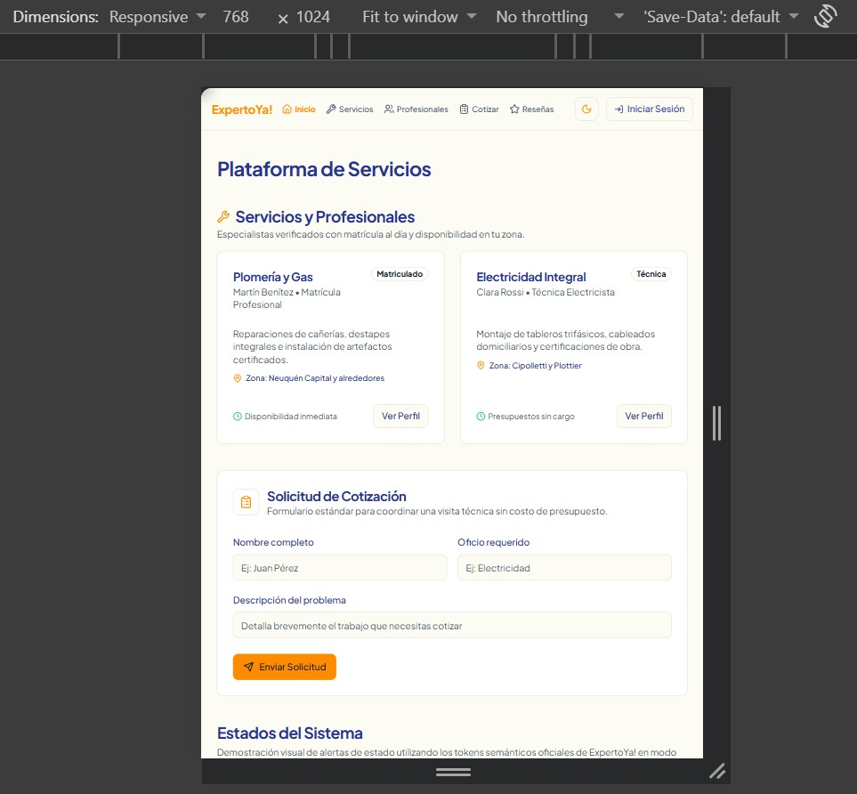
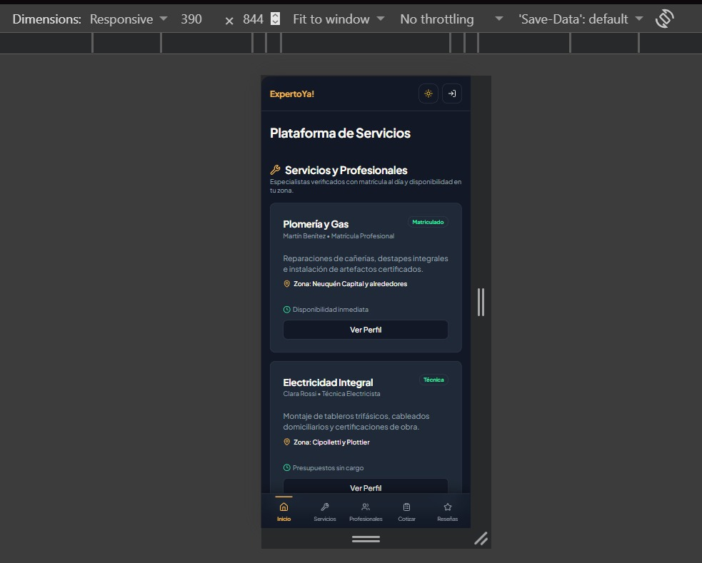
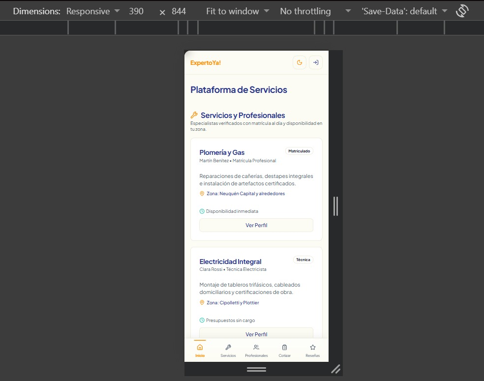

# Auditoría de Interfaz Multidispositivo y Usabilidad (Tarea 11)
**Proyecto:** ExpertoYa!  
**Materia:** Frameworks e Interoperabilidad - TP2  

## 1. Introducción y Objetivo
El presente documento detalla los resultados de la auditoría de usabilidad e interfaz multidispositivo realizada sobre la plataforma "ExpertoYa!". El objetivo principal es asegurar la correcta visualización, adaptación y accesibilidad del sistema en distintos tamaños de pantalla, abordando de manera directa las recomendaciones de mejora indicadas por la cátedra durante el Trabajo Práctico N°1 respecto al diseño *Responsive*.

## 2. Metodología y Entornos de Prueba
Las pruebas fueron ejecutadas en un entorno de desarrollo local (`localhost:5173`) utilizando las herramientas de desarrollo del navegador (Google Chrome DevTools). Se simularon las siguientes resoluciones estándar del mercado:

*   **Mobile (Smartphone):** 390 x 844 px (Viewport equivalente a un iPhone 12/13/14 Pro).
*   **Tablet:** 768 x 1024 px (Viewport estándar de iPad).
*   **Desktop:** 1920 x 1080 px (Resolución Full HD).

## 3. Análisis Detallado por Módulo y Dispositivo

### 3.1 Módulo 1: Catálogo de Servicios / Publicaciones
*   **Arquitectura Backend (API):** Se ha implementado exitosamente el entorno con Node.js y Express.js. El servidor expone de manera correcta los endpoints `GET /api/servicios` (para proveer la lista de oficios al Frontend) y `POST /api/servicios` (para registrar nuevas publicaciones), respondiendo con una estructura JSON robusta.
*   **Interfaz (Desktop / Tablet):** Las tarjetas de oficios (alimentadas por el catálogo) se presentan adecuadamente en una grilla de dos columnas (`grid-cols-2`), aprovechando el espacio horizontal. El formulario de cotización mantiene proporciones legibles.
*   **Interfaz (Mobile):** El sistema colapsa correctamente a una sola columna (`grid-cols-1`). Las tarjetas ocupan el 100% del ancho disponible, facilitando la lectura sin requerir *scroll* horizontal. Los botones principales ("Ver Perfil") son de ancho completo, lo que mejora drásticamente el área táctil (*touch target*).

### 3.2 Módulo 2: Sistema de Reseñas Closed-Loop
*   **Desktop / Tablet:** El formulario para dejar una nueva reseña y el listado del historial conviven armoniosamente distribuidos en un *layout* de proporciones 5:7 a través de las columnas de la grilla principal.
*   **Mobile:** El layout se apila verticalmente. El formulario de reseña toma prioridad en la parte superior, seguido por el listado de reseñas, manteniendo un flujo de lectura natural para el usuario de oficios.

### 3.3 Módulo 3: Gestión de Usuarios y Perfiles
*   **Desktop / Tablet:** El formulario de registro aprovecha una grilla de dos columnas para los campos de datos (Email, Contraseña, Zona), compactando la información eficientemente.
*   **Mobile:** Se detectó y corrigió un problema de legibilidad y áreas táctiles (campos estrechos) modificando las clases CSS (`grid-cols-2` a `grid-cols-1 sm:grid-cols-2`). Ahora, en resoluciones móviles menores a 640px, los inputs se apilan verticalmente, garantizando una escritura cómoda.

### 3.4 Sistema de Navegación
*   **Desktop / Tablet:** Se utiliza una barra de navegación superior (Header) fija, con enlaces claros y un botón visible para alternar entre el modo claro y oscuro.
*   **Mobile:** La barra superior se simplifica. Se implementó una **barra de navegación inferior flotante (Bottom Nav)**, anclada al borde inferior de la pantalla, que resulta mucho más ergonómica para el uso a una sola mano en celulares.

## 4. Evaluación de Atributos de Diseño y Usabilidad
Se ha verificado la correcta implementación de nuestro *Design System*:
1.  **Tipografía:** Integración correcta de *Plus Jakarta Sans*, con jerarquías claras (H1 a H3) que facilitan el escaneo visual de los servicios.
2.  **Accesibilidad y Contraste (WCAG AA):** Las paletas *Light* y *Dark* mode utilizan tokens semánticos (Background vs Foreground, Primario, Secundario) que superan el ratio mínimo de contraste (4.5:1).
3.  **Doble Codificación:** Las alertas de estado del sistema (Éxito, Peligro, Advertencia) no solo utilizan colores semánticos (Verde, Rojo, Naranja), sino que están siempre acompañadas de íconos representativos (Lucide React), cumpliendo con principios básicos de accesibilidad.

## 5. Conclusión General
Tras la ejecución de los ajustes en las grillas de los formularios, la interfaz de "ExpertoYa!" cumple de manera satisfactoria con los criterios de usabilidad y diseño responsivo (*Mobile-First*) exigidos. El sistema provee una experiencia fluida, componentes con áreas táctiles generosas (ideales para el perfil de clientes y profesionales de oficios) y un comportamiento robusto frente al cambio de dispositivos.

## 6. Anexos Visuales: Evidencia en Simulador DevTools
A continuación se presentan las capturas de pantalla obtenidas directamente desde el emulador de dispositivos de las herramientas de desarrollo del navegador, evidenciando las dimensiones evaluadas:

### Vista Escritorio (Desktop)
Diseño expandido, menú superior completo y grillas adaptadas aprovechando el ancho disponible. Evidencia de legibilidad en ambas paletas semánticas.

* **Modo Oscuro (Dark Theme):**

* **Modo Claro (Light Theme):**

---

### Vista Tablet
Transición intermedia donde la grilla se reduce a 2 columnas y los márgenes se ajustan sin alterar la legibilidad de la fuente Plus Jakarta Sans.

* **Modo Oscuro (Dark Theme):**

* **Modo Claro (Light Theme):**

---

### Vista Móvil (Mobile)
Adaptación a 1 sola columna vertical, menú de navegación inferior fijo, ausencia de scroll horizontal y botones a todo ancho maximizando el área táctil.

* **Modo Oscuro (Dark Theme):**

* **Modo Claro (Light Theme):**

