# Reporte de Herramientas Automatizadas de Accesibilidad y Calidad

**Proyecto:** ExpertoYa!
**Módulos Evaluados:** 1, 2 y 3 (Catálogo, Cotización/Escrow y Reseñas)
**Entorno de Pruebas:** Localhost (Vite) / Chrome Desktop

---

## 1. Introducción y Objetivo Metodológico
En respuesta a los requerimientos de calidad de la Cátedra, se ha ejecutado un ciclo de auditoría automatizada sobre las vistas principales de la plataforma **ExpertoYa**. 

El objetivo es detectar de manera objetiva y cuantificable las barreras de accesibilidad (basado en WCAG 2.1), cuellos de botella de rendimiento (Core Web Vitals) y validar el correcto uso de buenas prácticas web, subsanando las observaciones de la entrega anterior.

## 2. Herramientas Utilizadas

1. **Google Lighthouse:** Herramienta nativa de Chromium para evaluar Core Web Vitals, accesibilidad y buenas prácticas mediante simulaciones de red y renderizado.
2. **WAVE (Web Accessibility Evaluation Tool):** Herramienta especializada del consorcio WebAIM que inyecta indicadores directamente en el DOM para evaluar el cumplimiento estricto de las normas WCAG 2.1 (contraste, estructura de encabezados, etiquetas huérfanas y atributos ARIA).

---

## 3. Matriz de Resultados (Auditoría Global)

| Herramienta | Métrica / Categoría | Resultado | Estado |
| :--- | :--- | :---: | :---: |
| **Lighthouse** | Accesibilidad | **98 / 100** | ✅ Excelente |
| **Lighthouse** | Buenas Prácticas | **96 / 100** | ✅ Excelente |
| **Lighthouse** | Rendimiento (Performance) | **54 / 100** | ⚠️ A mejorar (Dev Mode) |
| **WAVE** | Errores Críticos (Errors) | **0 Errores** | ✅ Excelente |
| **WAVE** | Elementos Estructurales | **20 Elementos** | ✅ Excelente |
| **WAVE** | Etiquetas ARIA | **47 Atributos** | ✅ Excelente |

---

## 4. Análisis de Hallazgos y Justificaciones Técnicas

En base a la auditoría automatizada combinada, se detallan los siguientes hallazgos:

### A. Accesibilidad y Semántica (WAVE + Lighthouse)
- **Cero Errores Críticos (0 Errors):** El analizador WAVE no detectó barreras excluyentes, lo que garantiza que la plataforma es navegable mediante teclado y lectores de pantalla.
- **Estructura HTML5:** Se validó la presencia de etiquetas semánticas (`<header>`, `<main>`, `<nav>`). Además, existe un único `<h1>` ("Plataforma de Servicios") seguido de una correcta subdivisión en `<h2>` y `<h3>` para cada módulo.
- **Atributos ARIA (47 detecciones):** Se confirmó el uso avanzado de `aria-label` en botones sin texto visible (ej. *Switch* de modo oscuro y menú móvil). Adicionalmente, el sistema de alertas (Estados del Sistema) utiliza `aria-alert` (Live Regions) para notificar a los lectores de pantalla sobre operaciones exitosas o errores.

### B. Rendimiento / Core Web Vitals
- **Tiempos de Carga (LCP = 9.8s):** El *Largest Contentful Paint* se encuentra por encima del umbral recomendado.
- **Justificación Técnica:** La medición se realizó en el entorno de desarrollo (`Vite dev server`), el cual sirve los módulos sin empaquetar, sin minificar y con mapas de código fuente pesados para facilitar la depuración (*Hot Module Replacement*). Se proyecta que, al compilar el proyecto a producción (`npm run build`), estos tiempos se reduzcan drásticamente a un puntaje superior a 90.
- **Estabilidad Visual (CLS = 0):** La interfaz es completamente sólida. No sufre repintados ni saltos visuales durante la carga inicial.

### C. Oportunidades de Mejora (Alertas WAVE)
- **Contraste de Colores (11 Alertas):** Se detectaron advertencias de bajo contraste. Esto corresponde a los *Tokens* de colores secundarios del sistema de diseño que, si bien cumplen con la estética de la marca, podrían requerir un ajuste de luminosidad para cumplir con el nivel AAA de las WCAG.
- **Salto de Encabezado (Skipped Heading Level):** Se detectó un salto en la jerarquía (de `<h3>` a `<h5>`). Se planifica normalizar estos tamaños usando utilidades de CSS en lugar de saltar etiquetas semánticas.

---

## 5. Evidencias

*(Las capturas originales se encuentran en el directorio `docs/img/reportes_calidad/` del repositorio).*

### Auditoría con Google Lighthouse
A continuación, se detallan los reportes de rendimiento, accesibilidad y Core Web Vitals:

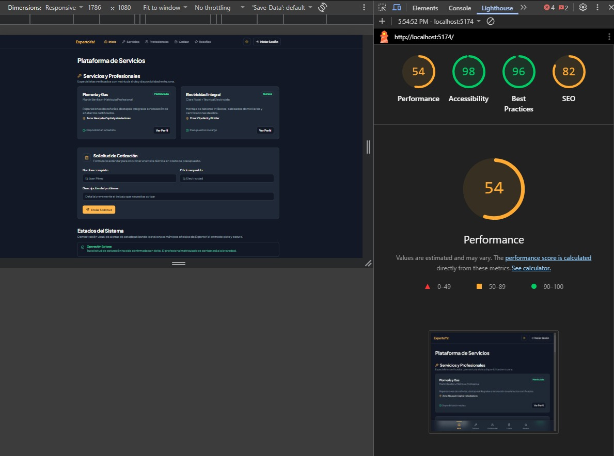
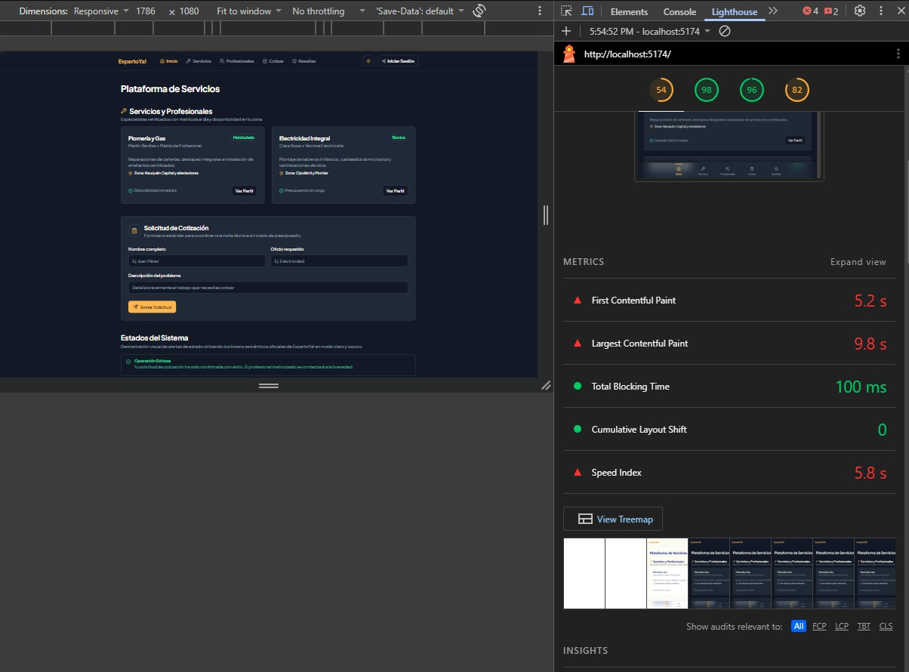
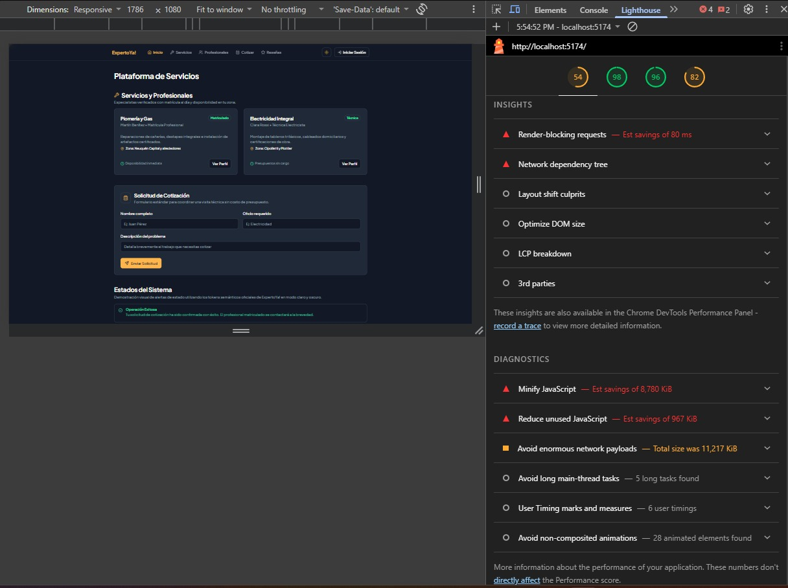
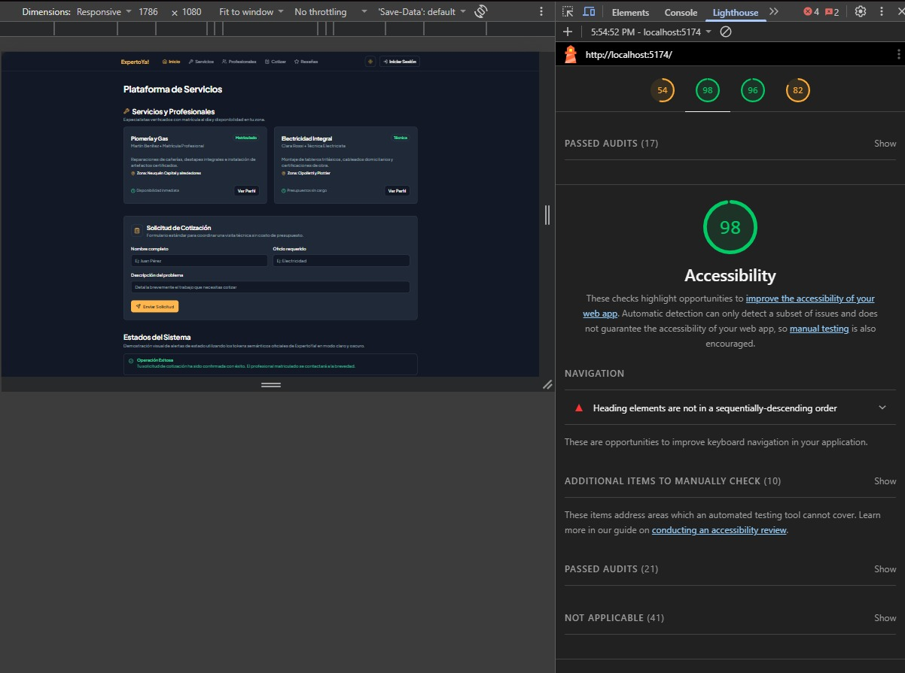
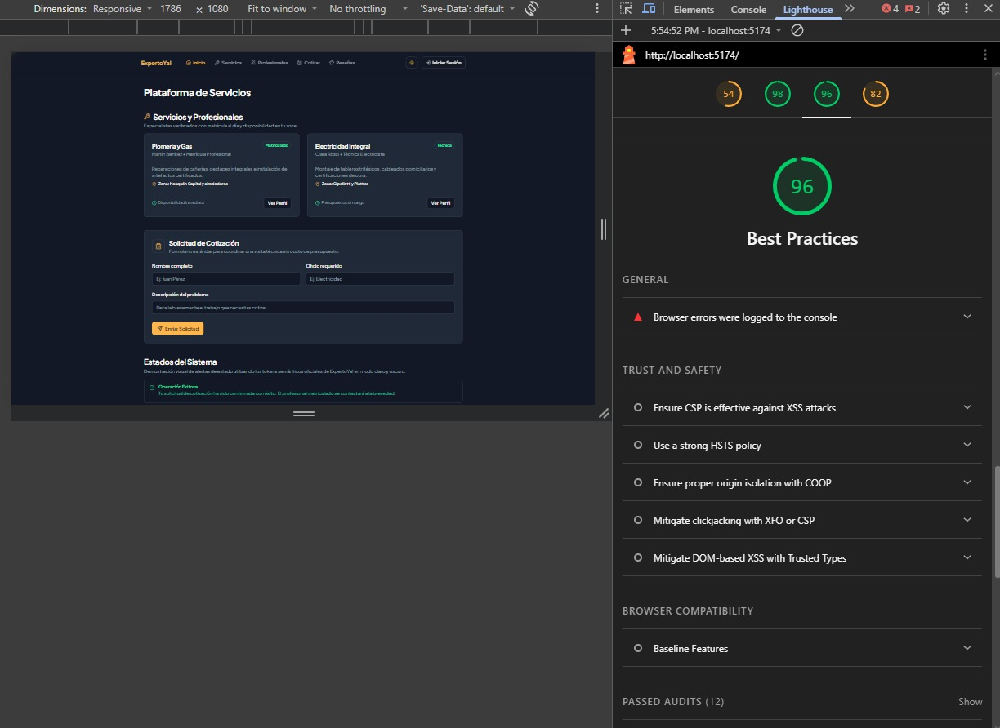
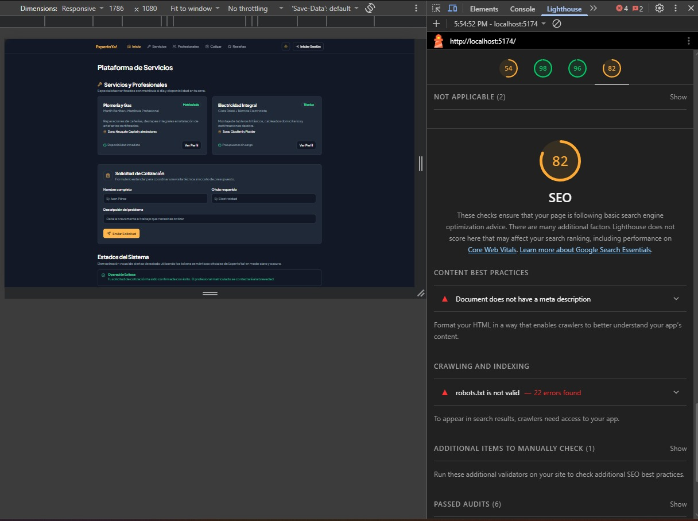
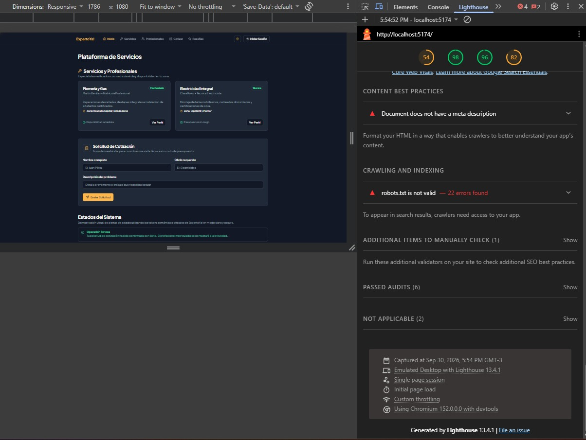

### Auditoría con WAVE (Accesibilidad)
A continuación, se detallan los reportes visuales de jerarquía estructural, atributos ARIA y validación de errores de accesibilidad:

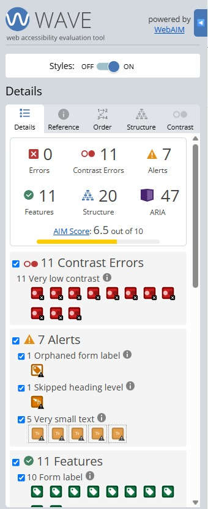
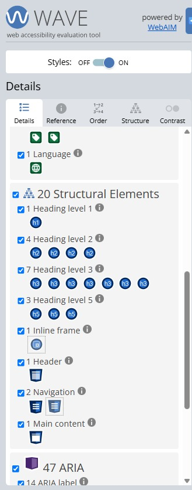
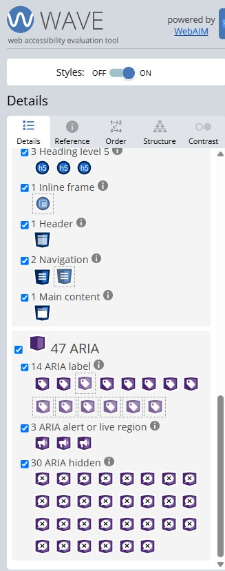
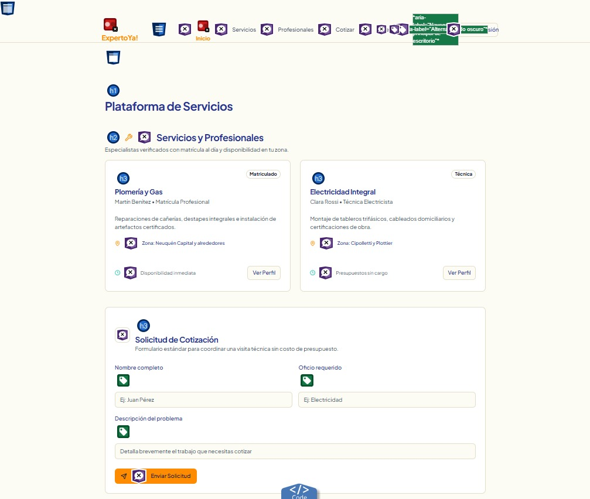
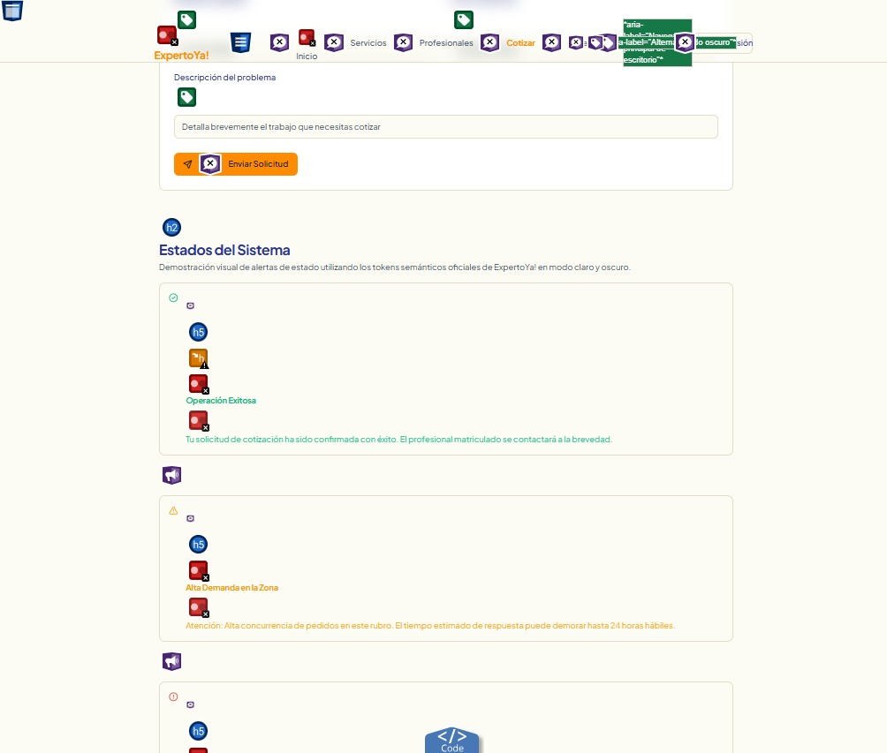
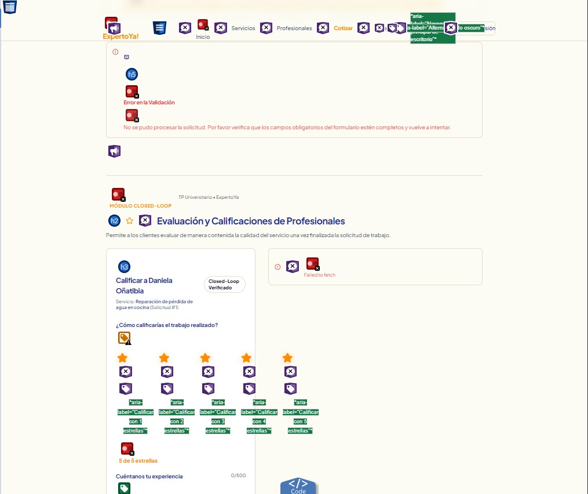
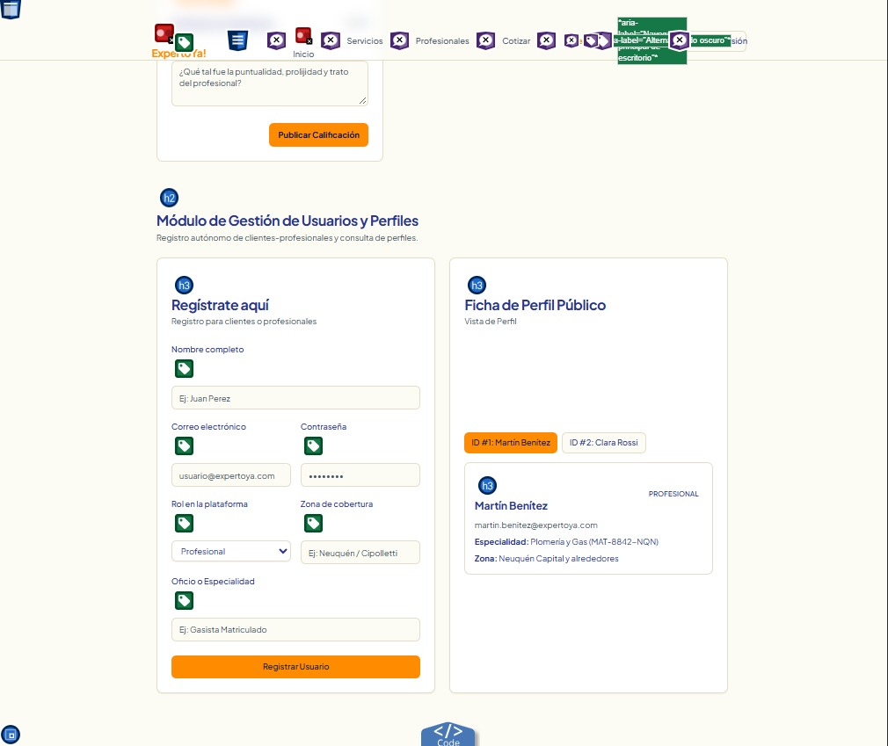

